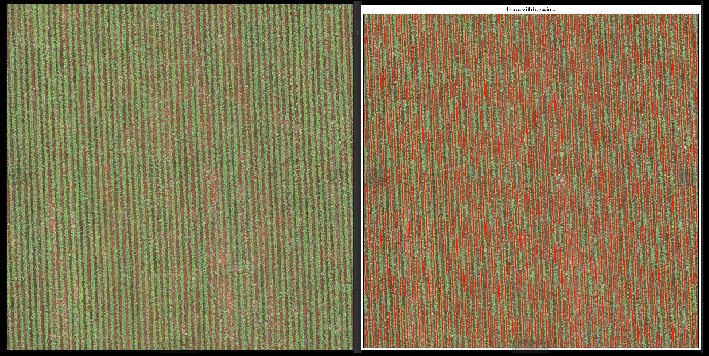

# Moray - api-plant-identification

This is a microservice developed for Plant Segmentation Challenge.

{width=20%}

## Process Execution

### Local

#### Conda

To learn more and how to install Conda, visit [link](https://conda.io/projects/conda/en/latest/user-guide/install/index.html).

First, go to the main project folder, create the environment locally and install the dependencies:

```console
conda create -n api python=3.8 -y
conda activate api
pip install -r requirements.txt
```

Run the application:

```console
export PORT=9191 && export MODE_DEPLOY=prod && export TAG=1.0.0 && export LOGLEVEL=DEBUG && gunicorn --bind 0.0.0.0:$PORT --workers 1 --threads 2 --preload main:app
```

#### Docker

First, install the [Docker](https://docs.docker.com/engine/install/) and [docker-compose](https://github.com/docker/compose)

Then go to the main project folder and run the command:

```console
docker-compose up -d
```

At the end of the process, the container will be running in [http://localhost:9191/v1/segment](http://localhost:9191/v1/segment)

### Google Cloud Run

#### Upload Image to Registry

To upload the image, make sure that the image has already been built with docker-compose and that you already have the gcloud-cli environment configured locally for your project [link](https://cloud.google.com/sdk/docs/install?hl=pt-br). You also need to have the Container Registry and Cloud Run enabled for your project.

Rename your image:

```console
docker tag api-plant-identification_server:latest gcr.io/{PROJECT_ID}/api-plant/api-plant-segmentation:local
```

Authenticate docker to gcloud:

```console
gcloud auth configure-docker
```

Then upload the image.

```console
docker push gcr.io/{PROJECT_ID}/api-plant/api-plant-segmentation:local
```

Finally, deploy it:

```console
gcloud run deploy api-plant-segmentation \
--allow-unauthenticated \
--platform=managed \
--image gcr.io/{PROJECT_ID}/api-plant/api-plant-segmentation:local \
--port 8080 --region us-central1 --cpu 1 --memory 512Mi --concurrency 2 --env-vars-file clouddeploy.yml
```

## Process Inference

### Request

To perform a classification, make a POST request to the address [http://localhost:9191/v1/segment](http://localhost:9191/v1/segment) passing the following json as an example in the body of the request:

There is a notebbok (/notebooks/RequestAPI.ipynb) with easy requests.

```json
{
  "base64": "base64codeimage",
  "bbox": False
}
```

The flag bbox informs if we want the bbox coordinates (bbox=True) or lines points (bbox=False).

### Responses

#### Success

Example of success in the segmentation process:

```json
{
  "message": "success",
  "data": {
    "pred_label": "1",
    "data": [[1,2], [3,4]...[..]]
  },
  "error": null,
  "version": "1.0.0"
}
```

The "pred_label" return specifies the cluster of image type.

#### Error

Example of error when the payload does not accord with the pattern request:

```json
{
  "message": "failed",
  "data": null,
  "error": {
    "raised": "KeyError",
    "raisedOn": "ApiSegment",
    "message": "'bbox'",
    "code": "400"
  },
  "version": "1.0.0"
}
```

### Results

The online api is available on [https://api-plant-segmentation-3dnj2pszeq-uc.a.run.app/v1/segment](https://api-plant-segmentation-3dnj2pszeq-uc.a.run.app/v1/segment)

The segmented images are available in the folder `/data_results`
